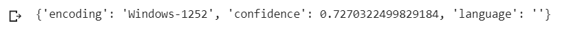
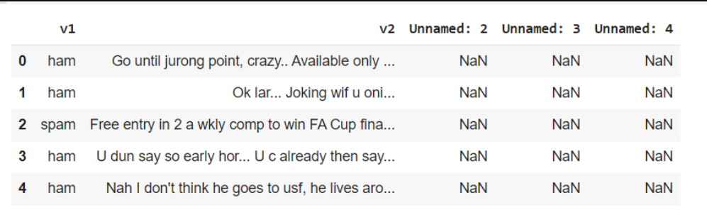
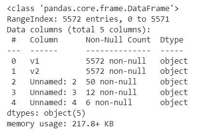
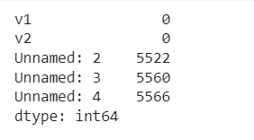
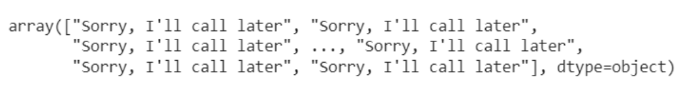
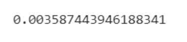

# Implementation-of-SVM-For-Spam-Mail-Detection

## AIM:
To write a program to implement the SVM For Spam Mail Detection.

## Equipments Required:
1. Hardware – PCs
2. Anaconda – Python 3.7 Installation / Jupyter notebook

## Algorithm

1. Import the required packages.
2. Import the dataset to operate on.
3. Split the dataset.
4. Predict the required output.
5. End the program.


## Program:
```
/*
Program to implement the SVM For Spam Mail Detection..
Developed by: MADHAN BABU P
RegisterNumber:  212222230075
*/
```

## Output:
## Result 

## data.head()

## data.info()

## data.isnull().sum()

## Y_prediction value

## Accuracy Value



## Result:
Thus the program to implement the SVM For Spam Mail Detection is written and verified using python programming.
